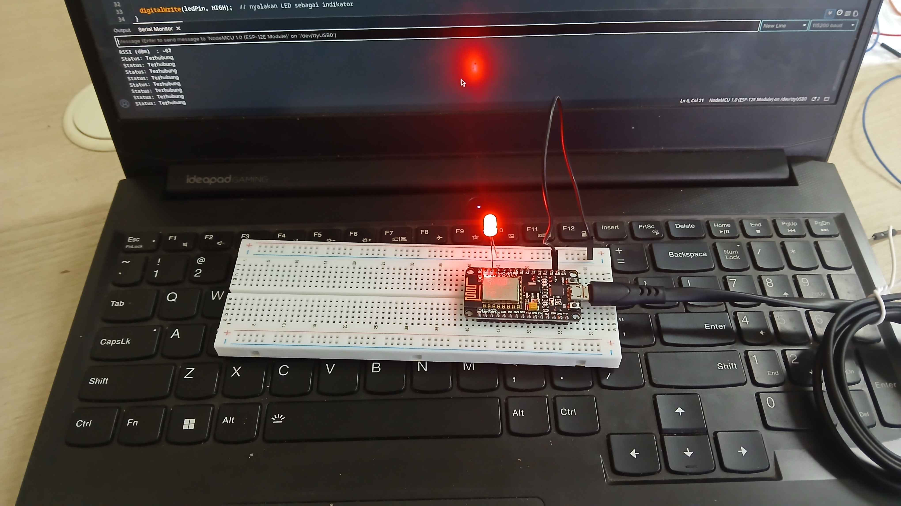

# Dokumentasi Percobaan 2A
## Gambar Percobaan

NodeMCU (ESP8266) berhasil terhubung ke jaringan WiFi pada mode Station. Serial Monitor menampilkan nilai RSSI sebesar -67 dBm dan status "Terhubung" yang berulang setiap 5 detik, sementara LED indikator pada breadboard menyala menandakan koneksi berhasil dibuat.

## Video Percobaan

_(tautan video dokumentasi dapat ditambahkan di sini)_

---

# Dokumentasi Percobaan 2B
## Gambar Percobaan

NodeMCU (ESP8266) berhasil dikonfigurasi sebagai Access Point dengan SSID "ESP8266_AccessPoint". SSID tersebut terlihat muncul pada daftar jaringan WiFi yang tersedia di perangkat lain, dan Serial Monitor menampilkan jumlah perangkat yang terhubung secara berkala.

## Video Percobaan

_(tautan video dokumentasi dapat ditambahkan di sini)_
