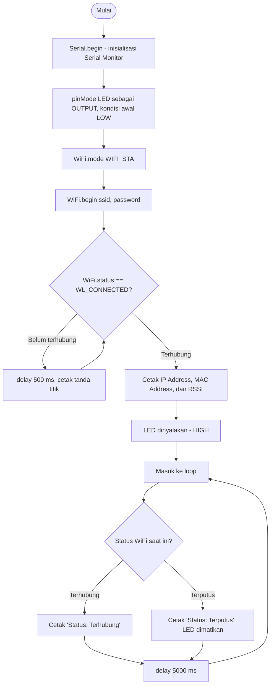

Nama: Dimas Rafif Zaidan  
NIM: H1H024043  
Shift Awal: C  
Shift Akhir: C

---

# Pertanyaan Praktikum - Percobaan 2A
## 1. Gambarkan diagram alur (flowchart) proses koneksi ESP32 ke jaringan WiFi pada program di atas!

Diagram di atas dibuat dalam bentuk Mermaid flowchart (langsung dapat dirender oleh GitHub) sehingga menggambarkan urutan proses mulai dari inisialisasi perangkat, percobaan koneksi berulang selama status belum WL_CONNECTED, hingga pemantauan status koneksi secara periodik pada loop().

---

## 2. Apa fungsi dari perintah WiFi.mode(WIFI_STA) pada program tersebut?
Perintah ini memberi tahu modul WiFi pada mikrokontroler (pada percobaan ini digunakan NodeMCU berbasis ESP8266, dengan pustaka ESP8266WiFi.h yang konsepnya identik dengan WiFi.h pada ESP32) untuk beroperasi sebagai Station, yaitu berperan sebagai perangkat klien yang menumpang ke jaringan WiFi yang sudah dipancarkan oleh perangkat lain (router/hotspot), bukan sebagai pemancar jaringan sendiri. Penentuan mode ini wajib dilakukan di awal karena modul WiFi pada mikrokontroler bersifat multi-mode (bisa STA, AP, atau keduanya), sehingga tanpa pemanggilan WiFi.mode() yang eksplisit, perilaku WiFi.begin() sesudahnya bisa tidak sesuai yang diharapkan.

---

## 3. Jelaskan apa yang terjadi apabila SSID atau password yang dimasukkan salah!
Jika SSID yang ditulis pada program salah/tidak sesuai dengan nama jaringan yang benar-benar dipancarkan, modul WiFi tidak akan pernah menemukan access point tujuan sama sekali, sehingga status koneksi tidak akan pernah berubah menjadi WL_CONNECTED dan perulangan while pada program terus berjalan mencetak tanda titik tanpa batas waktu. Sebaliknya, jika SSID sudah benar tetapi password yang dimasukkan keliru, perangkat akan berhasil menemukan access point dan mencoba melakukan proses autentikasi, namun autentikasi tersebut akan ditolak oleh access point sehingga status koneksi tetap berada pada kondisi tidak terhubung — gejalanya di layar Serial Monitor sama persis dengan kasus SSID salah, yaitu program terus mencetak titik tanpa henti. Karena program pada modul ini tidak memiliki batas waktu (timeout), kedua kondisi kesalahan tersebut menyebabkan mikrokontroler seolah "hang" menunggu koneksi yang tidak akan pernah berhasil.

---

## 4. Modifikasi program agar ESP32 mencoba menghubungkan ulang (reconnect) secara otomatis apabila koneksi WiFi terputus, dan berikan penjelasan di setiap baris kode yang ditambahkan dalam bentuk README.md!
```cpp
#include <ESP8266WiFi.h>

const char* ssid     = "mas";
const char* password = "dang4444";
const int ledPin = D2;

// --- Kode baru: penanda waktu terakhir pengecekan status, dipakai agar loop() tidak diblokir delay panjang ---
unsigned long waktuCekTerakhir = 0;
const unsigned long jedaCek = 5000;      // jarak antar pengecekan status koneksi (5 detik)
const unsigned long batasTungguKoneksi = 10000; // --- Kode baru: batas waktu maksimal menunggu saat mencoba connect (10 detik)

// --- Kode baru: fungsi terpisah agar proses koneksi bisa dipanggil ulang kapan saja tanpa menulis ulang logikanya ---
void prosesKoneksiWiFi() {
  WiFi.mode(WIFI_STA);
  WiFi.begin(ssid, password);
  Serial.print("Menghubungkan ke WiFi");

  unsigned long mulai = millis();
  // --- Kode baru: while diberi syarat tambahan timeout agar tidak menunggu selamanya ---
  while (WiFi.status() != WL_CONNECTED && millis() - mulai < batasTungguKoneksi) {
    delay(300);
    Serial.print(".");
  }

  if (WiFi.status() == WL_CONNECTED) {
    Serial.println("\nBerhasil terhubung kembali!");
    Serial.print("IP Address : ");
    Serial.println(WiFi.localIP());
    digitalWrite(ledPin, HIGH);
  } else {
    // --- Kode baru: jika sampai batas waktu tetap gagal, tandai lewat LED mati dan pesan ---
    Serial.println("\nPercobaan koneksi gagal, akan dicoba lagi pada siklus berikutnya.");
    digitalWrite(ledPin, LOW);
  }
}

void setup() {
  Serial.begin(115200);
  pinMode(ledPin, OUTPUT);
  digitalWrite(ledPin, LOW);
  prosesKoneksiWiFi();   // panggilan pertama saat perangkat baru menyala
}

void loop() {
  // --- Kode baru: cek berkala berbasis millis(), bukan delay() panjang, supaya loop tetap responsif ---
  if (millis() - waktuCekTerakhir >= jedaCek) {
    waktuCekTerakhir = millis();

    if (WiFi.status() == WL_CONNECTED) {
      Serial.println("Status: Terhubung");
    } else {
      // --- Kode baru: begitu terdeteksi putus, langsung panggil ulang fungsi koneksi (reconnect otomatis) ---
      Serial.println("Status: Terputus, mencoba menghubungkan ulang...");
      digitalWrite(ledPin, LOW);
      prosesKoneksiWiFi();
    }
  }
}
```
Penjelasan singkat: logika koneksi dipindahkan ke fungsi `prosesKoneksiWiFi()` agar dapat dipanggil berulang kali, ditambah timeout 10 detik supaya program tidak terjebak selamanya saat gagal connect, dan pengecekan status pada `loop()` memakai `millis()` (bukan `delay()` yang memblokir) sehingga saat koneksi terdeteksi putus, perangkat langsung mencoba menyambung ulang secara otomatis tanpa perlu ditekan tombol reset.

---

# Pertanyaan Praktikum - Percobaan 2B
## 1. Mengapa alamat IP default Access Point pada ESP32 umumnya bernilai 192.168.4.1?
Nilai 192.168.4.1 adalah alamat bawaan yang sudah ditentukan di dalam SDK WiFi milik Espressif (berlaku juga pada ESP8266 yang digunakan pada percobaan ini) ketika perangkat diaktifkan sebagai Access Point tanpa konfigurasi IP kustom. Alamat ini termasuk dalam blok IP privat 192.168.0.0/16 yang memang dikhususkan untuk jaringan lokal dan tidak akan bentrok dengan alamat di internet publik. Karena nilainya selalu sama pada kondisi default, pengguna maupun developer dapat langsung mengakses perangkat (misalnya membuka halaman konfigurasi web) tanpa perlu mencari tahu IP-nya terlebih dahulu, kecuali memang sengaja diubah lewat fungsi seperti `WiFi.softAPConfig()`.

---

## 2. Apa perbedaan mendasar antara mode Station dan mode Access Point pada ESP32?
Mode Station membuat mikrokontroler berperan sebagai "tamu" pada jaringan yang sudah ada milik pihak lain — ia harus mengetahui SSID dan password router/hotspot tersebut, lalu menerima alamat IP dari DHCP server milik router itu. Mode Access Point justru kebalikannya: mikrokontroler yang menjadi "tuan rumah", memancarkan SSID dan password buatannya sendiri, bertindak sebagai DHCP server yang membagikan alamat IP ke perangkat lain yang bergabung, dan tidak bergantung sama sekali pada jaringan eksternal untuk bisa diakses.

---

## 3. Jelaskan risiko keamanan apabila password Access Point tidak diberikan atau terlalu sederhana!
Access Point tanpa password (open network) atau dengan password yang mudah ditebak (misalnya "12345678" atau kata umum) membuat siapa saja yang berada dalam jangkauan sinyal dapat bergabung tanpa izin. Dampaknya antara lain: data yang lewat jaringan tersebut rawan disadap karena enkripsi lemah atau tidak ada sama sekali, penyerang dapat mengakses langsung perangkat IoT yang terhubung ke Access Point tersebut (misalnya mengubah pengaturan atau mengirim perintah palsu ke aktuator), bandwidth dan sumber daya Access Point terbebani oleh perangkat asing, serta jaringan menjadi lebih rentan terhadap serangan brute-force karena kombinasi password yang harus dicoba penyerang jauh lebih sedikit. Oleh sebab itu, password AP idealnya cukup panjang, kombinasi karakter yang bervariasi, dan tidak mudah ditebak.

---

## 4. Modifikasi program agar ESP32 berjalan pada mode AP+STA (terhubung ke WiFi rumah sekaligus menyediakan Access Point), dan berikan penjelasan di setiap baris kode nya dalam bentuk README.md!
```cpp
#include <ESP8266WiFi.h>

// --- Kode baru: kredensial jaringan rumah untuk sisi Station ---
const char* sta_ssid     = "mas";
const char* sta_password = "dang4444";

// Kredensial Access Point yang tetap dipancarkan perangkat
const char* ap_ssid     = "ESP8266_AccessPoint";
const char* ap_password = "12345678";

void setup() {
  Serial.begin(115200);

  // --- Kode baru: gabungan mode AP dan STA aktif bersamaan ---
  WiFi.mode(WIFI_AP_STA);

  // Bagian Access Point tetap disediakan seperti pada Percobaan 2B
  WiFi.softAP(ap_ssid, ap_password);
  Serial.print("AP IP Address  : ");
  Serial.println(WiFi.softAPIP());

  // --- Kode baru: bagian Station, mencoba tersambung ke jaringan rumah secara bersamaan ---
  WiFi.begin(sta_ssid, sta_password);
  Serial.print("Menghubungkan ke jaringan rumah");

  unsigned long mulai = millis();
  while (WiFi.status() != WL_CONNECTED && millis() - mulai < 10000) {
    delay(300);
    Serial.print(".");
  }

  if (WiFi.status() == WL_CONNECTED) {
    Serial.println();
    Serial.print("STA IP Address : ");
    Serial.println(WiFi.localIP());
  } else {
    Serial.println("\nGagal tersambung ke jaringan rumah, mode AP tetap berjalan normal.");
  }
}

void loop() {
  // Memantau jumlah perangkat yang tersambung ke sisi Access Point setiap 5 detik
  int jumlahClient = WiFi.softAPgetStationNum();
  Serial.print("Jumlah client pada AP: ");
  Serial.println(jumlahClient);
  delay(5000);
}
```
Penjelasan singkat: dengan `WiFi.mode(WIFI_AP_STA)`, perangkat dapat menjalankan dua peran sekaligus dalam satu program — bagian `WiFi.softAP()` tetap membuat perangkat terlihat sebagai Access Point mandiri, sementara `WiFi.begin()` di baris berikutnya membuat perangkat yang sama juga mencoba bergabung ke jaringan rumah sebagai klien, tanpa saling mengganggu satu sama lain.

---

# Pertanyaan Analisis
## 1. Uraikan hasil tugas pada praktikum yang telah dilakukan pada setiap percobaan!
Pada Percobaan 2A, NodeMCU (ESP8266) berhasil disetel pada mode Station dan tersambung ke jaringan WiFi yang telah ditentukan; Serial Monitor menampilkan nilai RSSI -67 dBm serta status "Terhubung" yang tercetak berulang setiap 5 detik, dan LED indikator pada breadboard menyala sesuai spesifikasi yang diminta modul. Pada Percobaan 2B, perangkat berhasil dijalankan sebagai Access Point mandiri dengan SSID "ESP8266_AccessPoint"; SSID tersebut terlihat pada daftar jaringan WiFi perangkat lain dan dapat disambungkan menggunakan password yang telah ditentukan, sementara Serial Monitor memantau jumlah client yang tersambung secara berkala. Kedua percobaan berjalan tanpa error kompilasi maupun error saat proses koneksi.

---

## 2. Bagaimana pengaruh kekuatan sinyal (RSSI) terhadap kestabilan koneksi WiFi pada perangkat IoT?
RSSI menunjukkan seberapa kuat sinyal WiFi yang diterima perangkat, dinyatakan dalam satuan dBm bernilai negatif, di mana angka yang lebih mendekati nol berarti sinyal lebih kuat (misalnya -67 dBm yang didapat pada percobaan ini masih tergolong cukup baik untuk komunikasi data yang stabil). Semakin rendah/negatif nilai RSSI (contohnya di bawah -80 dBm), semakin besar kemungkinan terjadinya packet loss, latensi tinggi, atau bahkan koneksi terputus-putus karena sinyal lemah lebih mudah terganggu oleh interferensi maupun jarak/penghalang fisik. Untuk aplikasi IoT yang mengirim data secara terus-menerus, menjaga RSSI tetap pada rentang yang baik (idealnya di atas -70 dBm) menjadi faktor penting agar pengiriman data tidak terganggu.

---

## 3. Bagaimana cara kerja ESP32 dalam membedakan peran sebagai klien (Station) dan sebagai penyedia jaringan (Access Point)?
Peran ini ditentukan lewat parameter yang dikirim ke `WiFi.mode()`: `WIFI_STA` membuat modul WiFi beroperasi sebagai klien, `WIFI_AP` membuatnya beroperasi sebagai penyedia jaringan, dan `WIFI_AP_STA` menjalankan keduanya sekaligus. Ketika berperan sebagai Station, modul WiFi melakukan proses scanning untuk menemukan access point tujuan lalu melakukan asosiasi/autentikasi melalui `WiFi.begin()`, kemudian meminta alamat IP dari DHCP server milik router tersebut. Ketika berperan sebagai Access Point, modul WiFi justru memancarkan SSID-nya sendiri lewat `WiFi.softAP()`, menjalankan fungsi DHCP server secara internal untuk membagikan IP ke perangkat lain, dan menangani sendiri proses autentikasi perangkat yang ingin bergabung.

---

## 4. Bagaimana kombinasi mode Station dan Access Point (AP+STA) dapat dimanfaatkan dalam skenario nyata sistem IoT, misalnya pada proses konfigurasi awal perangkat (provisioning)?
Mode AP+STA sangat berguna pada tahap provisioning, yaitu saat perangkat IoT baru pertama kali dinyalakan dan belum mengetahui kredensial WiFi rumah/kantor tempatnya akan dipasang. Perangkat dapat mengaktifkan sisi Access Point terlebih dahulu agar pengguna bisa langsung menyambungkan smartphone ke perangkat tersebut dan memasukkan SSID/password jaringan rumah melalui halaman web sederhana yang dihosting oleh perangkat itu sendiri. Begitu kredensial berhasil disimpan, perangkat dapat langsung mencoba tersambung ke jaringan rumah lewat sisi Station tanpa perlu mematikan Access Point-nya terlebih dahulu, sehingga pengguna tidak perlu meng-hardcode SSID/password ke dalam kode program maupun menghubungkan perangkat ke komputer secara manual. Pola ini banyak dipakai pada perangkat IoT komersial seperti smart plug, smart bulb, atau kamera pintar agar proses instalasi awal terasa lebih mudah bagi pengguna akhir.
