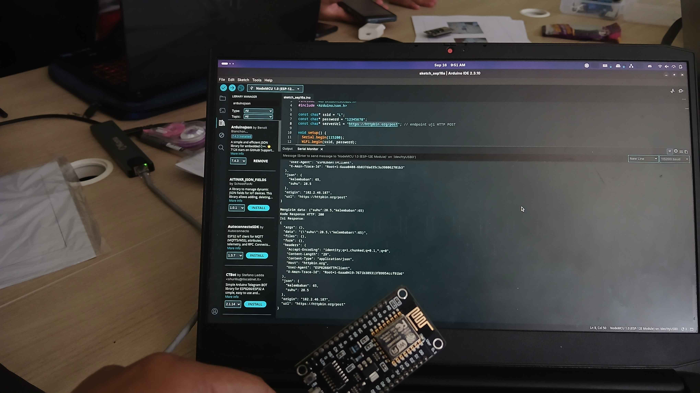
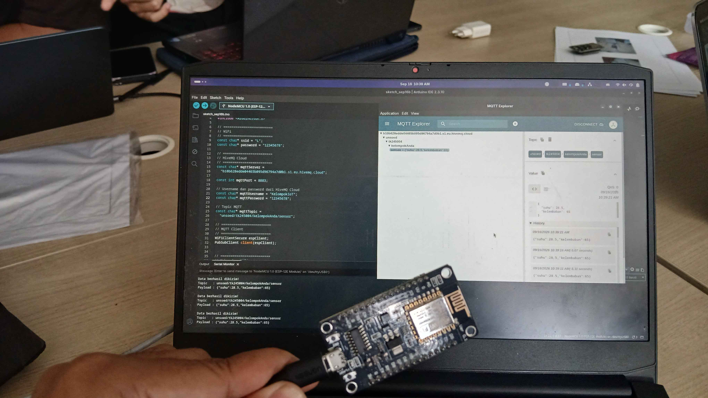

# Dokumentasi Percobaan 3A
## Gambar Percobaan

NodeMCU (ESP8266) berhasil terhubung ke jaringan WiFi dan mengirimkan data sensor (suhu 28.5°C dan kelembaban 65%) dalam format JSON ke endpoint `https://httpbin.org/post` menggunakan metode HTTP POST. Serial Monitor pada Arduino IDE menampilkan payload yang dikirim (`Mengirim data: {"suhu":28.5,"kelembaban":65}`), kode response HTTP bernilai 200, serta isi response yang dikembalikan oleh server berupa echo dari data JSON yang dikirim beserta detail header request (Content-Type, Content-Length, User-Agent, dsb).

## Video Percobaan

_(tautan video dokumentasi dapat ditambahkan di sini)_

---

# Dokumentasi Percobaan 3B
## Gambar Percobaan

NodeMCU (ESP8266) berhasil terhubung ke broker MQTT (HiveMQ Cloud, port 8883 dengan koneksi TLS) dan mempublikasikan data sensor dalam format JSON ke topic `unsoed/tk245004/kelompokAnda/sensor` setiap 5 detik. Serial Monitor menampilkan status "Data berhasil dikikim!" beserta topic dan payload yang dikirim, sementara aplikasi MQTT Explorer yang melakukan subscribe ke topic yang sama menunjukkan payload `{"suhu": 28.5, "kelembaban": 65}` diterima secara berkala pada bagian History, membuktikan proses publish-subscribe berjalan sesuai spesifikasi.

## Video Percobaan

_(tautan video dokumentasi dapat ditambahkan di sini)_
