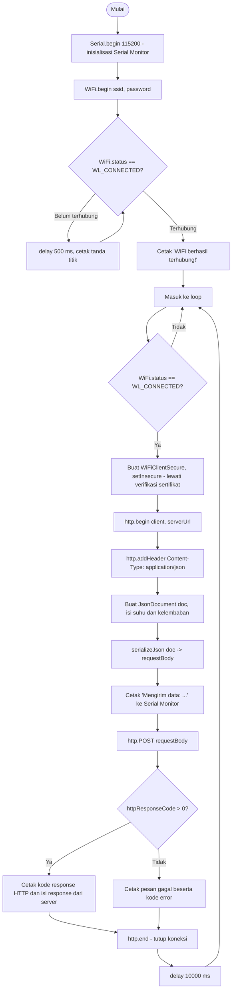

Nama: Dimas Rafif Zaidan  
NIM: H1H024043  
Shift Awal: C  
Shift Akhir: C

---

# Pertanyaan Praktikum - Percobaan 3A (HTTP)

## 1. Gambarkan diagram alur (flowchart) proses pengiriman data melalui HTTP POST pada program di atas!

Diagram di atas dibuat dalam bentuk Mermaid flowchart yang langsung dapat dirender oleh GitHub, menggambarkan alur mulai dari inisialisasi dan koneksi WiFi pada `setup()`, hingga proses berulang pada `loop()` yang membentuk koneksi HTTPS (karena `httpbin.org` menggunakan TLS, sehingga digunakan `WiFiClientSecure` dengan `setInsecure()`), menyusun data sensor menjadi JSON, mengirimkannya lewat `http.POST()`, dan mencetak hasil response sebelum mengulang siklus setiap 10 detik.

---

## 2. Apa fungsi dari perintah http.addHeader("Content-Type", "application/json") pada program tersebut?
Perintah ini menambahkan header HTTP bernama `Content-Type` dengan nilai `application/json` pada request yang akan dikirim ke server. Header ini berfungsi memberi tahu server bahwa isi (body) dari request yang dikirimkan berformat JSON, sehingga server tahu cara yang benar untuk mem-parsing/membaca data tersebut (bukan sebagai teks biasa, form data, atau format lain). Tanpa header ini, ada kemungkinan server salah menginterpretasikan isi body atau menolak memprosesnya sesuai format JSON yang dimaksud, terutama pada API/endpoint yang secara ketat memvalidasi tipe konten yang diterima.

---

## 3. Jelaskan arti dari kode response HTTP 200 dan sebutkan salah satu contoh kode response HTTP lain beserta artinya!
Kode response HTTP 200 (OK) menandakan bahwa request yang dikirimkan oleh klien (ESP8266/ESP32) berhasil diterima, diproses, dan dipenuhi oleh server tanpa ada masalah; pada kasus percobaan ini, `httpbin.org/post` mengembalikan kode 200 disertai isi response berupa echo dari data JSON yang dikirim, sebagai bukti bahwa data benar-benar sampai dan diproses dengan baik oleh server. Salah satu contoh kode response HTTP lain adalah **404 (Not Found)**, yang berarti resource atau endpoint yang diminta oleh klien tidak ditemukan di server — misalnya karena URL/endpoint yang dituju salah ketik atau memang sudah tidak tersedia lagi. Contoh lain yang juga relevan pada konteks IoT adalah **401 (Unauthorized)**, yang menandakan request ditolak karena klien belum menyertakan kredensial otentikasi yang valid.

---

## 4. Modifikasi program agar ESP32 dapat mengirimkan data tambahan berupa waktu (dalam milidetik sejak dinyalakan menggunakan millis()) ke dalam JSON yang dikirim, dan berikan penjelasan di setiap baris kode yang ditambahkan!
```cpp
#include <ESP8266WiFi.h>
#include <ESP8266HTTPClient.h>
#include <WiFiClientSecure.h>
#include <ArduinoJson.h>

const char* ssid = "L";
const char* password = "12345678";
const char* serverUrl = "https://httpbin.org/post"; // endpoint uji HTTP POST

void setup() {
  Serial.begin(115200);
  WiFi.begin(ssid, password);

  Serial.print("Menghubungkan ke WiFi");
  while (WiFi.status() != WL_CONNECTED) {
    delay(500);
    Serial.print(".");
  }
  Serial.println();
  Serial.println("WiFi berhasil terhubung!");
}

void loop() {
  if (WiFi.status() == WL_CONNECTED) {
    WiFiClientSecure client;
    client.setInsecure(); // lewati verifikasi sertifikat (cukup untuk keperluan uji coba/praktikum)

    HTTPClient http;
    http.begin(client, serverUrl);
    http.addHeader("Content-Type", "application/json");

    // Membuat objek data sensor dalam format JSON
    JsonDocument doc;
    doc["suhu"] = 28.5;       // contoh data suhu (°C)
    doc["kelembaban"] = 65.0; // contoh data kelembaban (%)

    // --- Kode baru: menambahkan waktu sejak perangkat menyala ke dalam JSON ---
    unsigned long waktuSekarang = millis(); // ambil jumlah milidetik sejak ESP dinyalakan/direset
    doc["waktu_ms"] = waktuSekarang;        // masukkan sebagai pasangan key-value baru pada JSON

    String requestBody;
    serializeJson(doc, requestBody);

    Serial.print("Mengirim data: ");
    Serial.println(requestBody);

    // Mengirim data melalui HTTP POST
    int httpResponseCode = http.POST(requestBody);

    if (httpResponseCode > 0) {
      Serial.print("Kode Response HTTP: ");
      Serial.println(httpResponseCode);
      Serial.println("Isi Response:");
      Serial.println(http.getString());
    } else {
      Serial.print("Pengiriman gagal, kode error: ");
      Serial.println(httpResponseCode);
    }

    http.end();
  }

  delay(10000); // kirim data setiap 10 detik
}
```
Penjelasan baris yang ditambahkan:
- `unsigned long waktuSekarang = millis();` — memanggil fungsi bawaan `millis()` yang mengembalikan jumlah milidetik sejak mikrokontroler terakhir kali dinyalakan atau di-reset, kemudian menyimpannya ke variabel bertipe `unsigned long` (karena nilai `millis()` terus bertambah dan bisa menjadi angka besar, tipe data ini dipakai agar sesuai kapasitasnya).
- `doc["waktu_ms"] = waktuSekarang;` — menambahkan pasangan key-value baru ke objek `JsonDocument` yang sudah ada, dengan key `"waktu_ms"` dan value berupa waktu yang sudah diambil sebelumnya, sehingga saat `serializeJson()` dipanggil, hasil JSON yang dikirim akan otomatis memuat field tambahan ini, contohnya menjadi `{"suhu":28.5,"kelembaban":65,"waktu_ms":123456}`.

Dengan penambahan ini, server (atau siapa pun yang membaca response echo dari `httpbin.org/post`) dapat mengetahui kapan (relatif terhadap waktu nyala perangkat) data sensor tersebut diambil dan dikirim, yang berguna misalnya untuk mengurutkan data atau mendeteksi jeda pengiriman yang tidak normal.

---

# Pertanyaan Praktikum - Percobaan 3B (MQTT)

## 1. Apa fungsi dari topic pada protokol MQTT, dan mengapa topic yang digunakan perlu dibuat unik?
Topic pada MQTT berfungsi sebagai "alamat" atau label yang digunakan broker untuk mengelompokkan dan meneruskan pesan dari publisher ke subscriber yang berlangganan pada topic yang sama; broker tidak memeriksa isi pesan, melainkan hanya mencocokkan topic pesan yang masuk dengan daftar topic yang di-subscribe oleh masing-masing client, lalu meneruskannya. Karena broker yang dipakai pada percobaan ini (HiveMQ Cloud, dan pada modul aslinya `broker.hivemq.com`) bersifat publik/dapat diakses banyak pengguna/kelompok sekaligus, topic yang digunakan wajib dibuat unik (pada percobaan ini `unsoed/tk245004/kelompokAnda/sensor`, dengan menyertakan identitas seperti NIM/nama kelompok) agar data yang dipublikasikan oleh satu kelompok tidak tercampur, bertabrakan, atau justru terbaca oleh client kelompok lain yang kebetulan memakai topic serupa.

---

## 2. Jelaskan fungsi dari perintah client.loop() yang dipanggil pada setiap iterasi loop()!
`client.loop()` adalah fungsi dari pustaka PubSubClient yang wajib dipanggil secara berkala (idealnya di setiap iterasi `loop()`) agar koneksi MQTT tetap berjalan dengan baik. Fungsi ini bertugas memproses komunikasi latar belakang dengan broker, seperti mengirimkan paket keep-alive (PINGREQ) agar broker tidak menganggap koneksi terputus akibat idle, menerima dan memproses pesan masuk apabila client juga melakukan subscribe ke suatu topic (memicu fungsi callback jika ada), serta menangani housekeeping internal dari koneksi TCP/TLS yang sedang berlangsung. Apabila `client.loop()` tidak dipanggil secara rutin, koneksi ke broker berisiko dianggap terputus oleh broker karena tidak ada aktivitas, meskipun secara fisik jaringan masih tersambung.

---

## 3. Apa yang akan terjadi apabila koneksi ke broker MQTT terputus di tengah program berjalan?
Apabila koneksi ke broker terputus, pengecekan `client.connected()` pada `loop()` akan bernilai `false`, sehingga program (sesuai kode pada percobaan ini) akan mencetak pesan "MQTT terputus!" ke Serial Monitor dan langsung memanggil kembali fungsi `hubungkanMQTT()` untuk mencoba menyambung ulang secara otomatis — fungsi tersebut akan terus mengulang percobaan koneksi (disertai jeda 2 detik pada setiap percobaan yang gagal) hingga berhasil terhubung kembali ke broker. Selama proses reconnect belum berhasil, setiap percobaan `client.publish()` yang dijalankan akan mengembalikan nilai `false` (gagal), sehingga data sensor pada periode tersebut tidak akan terkirim ke broker dan program akan mencetak pesan "Gagal mengirim data!"; setelah koneksi pulih, proses publish data kembali berjalan normal seperti sebelumnya tanpa perlu me-reset perangkat secara manual.

---

# Pertanyaan Analisis

## 1. Uraikan hasil tugas pada praktikum yang telah dilakukan pada setiap percobaan!
Pada Percobaan 3A, NodeMCU (ESP8266) berhasil terhubung ke jaringan WiFi dan mengirimkan data sensor (suhu 28.5°C dan kelembaban 65%) dalam format JSON ke endpoint `https://httpbin.org/post` menggunakan HTTP POST melalui koneksi HTTPS (`WiFiClientSecure` dengan `setInsecure()`, karena `httpbin.org` mewajibkan TLS); Serial Monitor menampilkan payload yang dikirim, kode response HTTP 200, serta isi response berupa echo data JSON yang dikirim lengkap dengan detail header request, menandakan data diterima dengan benar oleh server. Pada Percobaan 3B, perangkat yang sama berhasil terhubung ke broker MQTT HiveMQ Cloud melalui koneksi TLS (port 8883) menggunakan autentikasi username/password, kemudian mempublikasikan data sensor JSON yang sama ke topic `unsoed/tk245004/kelompokAnda/sensor` setiap 5 detik; data yang dipublikasikan berhasil diverifikasi menggunakan aplikasi MQTT Explorer yang melakukan subscribe ke topic yang sama, terlihat dari riwayat pesan yang terus bertambah setiap beberapa detik. Kedua percobaan berjalan tanpa error kompilasi maupun error koneksi, sehingga hasilnya sudah sesuai dengan spesifikasi yang diminta modul.

---

## 2. Bandingkan besar overhead data dan pola komunikasi antara protokol HTTP dan MQTT berdasarkan hasil percobaan yang telah dilakukan!
Dari hasil percobaan terlihat jelas perbedaan overhead antara kedua protokol. Pada Percobaan 3A, setiap kali mengirim data sensor yang sebenarnya hanya berukuran kecil (`{"suhu":28.5,"kelembaban":65}`), request HTTP yang dikirim tetap harus menyertakan berbagai header tambahan (terlihat pada isi response echo dari `httpbin.org`, seperti `Accept-Encoding`, `Content-Length`, `Content-Type`, `Host`, `User-Agent`, hingga `X-Amzn-Trace-Id`), dan setiap siklus `loop()` membuka koneksi TCP+TLS baru lewat `http.begin()`/`http.end()` yang kemudian ditutup lagi setelah selesai — pola ini disebut request-response yang bersifat stateless dan "sekali pakai" per request. Sebaliknya pada Percobaan 3B, koneksi TCP+TLS ke broker MQTT hanya dibentuk sekali di awal dan dijaga tetap terbuka (persistent connection) sepanjang program berjalan berkat pemanggilan `client.loop()` secara terus-menerus; setiap pengiriman data selanjutnya hanya berupa paket publish yang ringan berisi nama topic dan payload JSON, tanpa perlu membangun ulang koneksi maupun menyertakan header selengkap HTTP. Dengan demikian, MQTT terbukti memiliki overhead komunikasi yang jauh lebih kecil dibandingkan HTTP untuk pengiriman data berulang, sesuai dengan karakteristik yang dijelaskan pada dasar teori modul.

---

## 3. Untuk skenario pengiriman data sensor secara terus-menerus setiap beberapa detik dalam jangka waktu lama, protokol manakah (HTTP atau MQTT) yang lebih sesuai digunakan? Jelaskan alasannya!
Untuk skenario tersebut, protokol **MQTT** jauh lebih sesuai digunakan dibandingkan HTTP. Alasan utamanya adalah MQTT hanya perlu membangun satu koneksi TCP/TLS yang dipertahankan tetap terbuka (persistent connection) selama program berjalan, sehingga tidak ada biaya (waktu maupun daya) berulang untuk melakukan handshake TCP dan TLS pada setiap pengiriman data seperti yang terjadi pada HTTP (yang membuka dan menutup koneksi baru di setiap siklus `http.begin()`/`http.end()`). Selain itu, ukuran paket publish MQTT jauh lebih kecil karena tidak menyertakan header selengkap HTTP, sehingga lebih hemat bandwidth dan daya — faktor yang sangat penting bagi perangkat IoT dengan sumber daya terbatas (misalnya bila menggunakan baterai) yang mengirim data setiap beberapa detik dalam jangka waktu lama. Pola publish-subscribe pada MQTT juga lebih fleksibel apabila di kemudian hari data yang sama perlu diterima oleh banyak aplikasi/dashboard sekaligus (banyak subscriber), tanpa perangkat IoT perlu mengirim data berulang kali ke masing-masing tujuan seperti pada pendekatan HTTP.

---

## 4. Bagaimana peran format JSON dalam mendukung interoperabilitas data antara perangkat IoT dan berbagai platform/aplikasi yang berbeda?
JSON berperan penting dalam mendukung interoperabilitas karena formatnya berbasis teks yang terstruktur secara sederhana (pasangan key-value), bersifat independen terhadap bahasa pemrograman maupun platform, dan sudah didukung secara luas oleh hampir semua bahasa pemrograman serta pustaka modern (JavaScript, Python, PHP, Java, hingga mikrokontroler seperti ESP8266/ESP32 lewat pustaka ArduinoJson yang digunakan pada percobaan ini). Karena strukturnya konsisten dan mudah dibaca baik oleh manusia maupun mesin, data sensor yang dikirim oleh ESP8266 — baik lewat HTTP POST pada Percobaan 3A maupun lewat publish MQTT pada Percobaan 3B — dapat langsung di-decode dan digunakan oleh berbagai pihak penerima yang berbeda, misalnya server backend, dashboard web, aplikasi mobile, ataupun aplikasi client MQTT seperti MQTT Explorer yang dipakai untuk verifikasi pada percobaan ini, tanpa perlu membuat parser data khusus untuk masing-masing platform. Hal ini membuat JSON menjadi "bahasa perantara" yang menjembatani perangkat IoT dengan berbagai ekosistem aplikasi yang mungkin dibangun dengan teknologi yang sama sekali berbeda.
